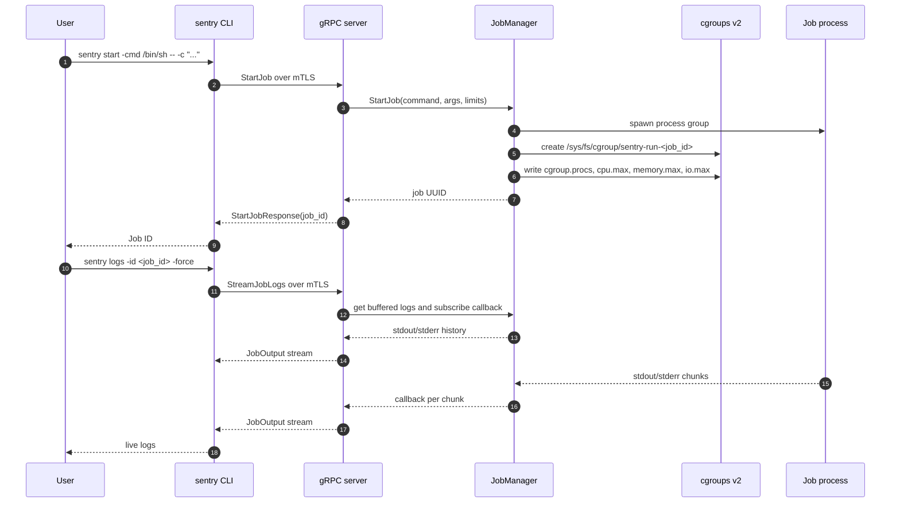

# Sentry Run

 [](https://github.com/arazmj/sentry/actions/workflows/go.yml)

A secure job management system that allows running and monitoring processes with resource constraints using cgroups on Linux systems. The system uses gRPC with mutual TLS authentication for secure client-server communication.

## Features

- Start jobs with resource constraints:
    - Memory limits
    - CPU limits
    - I/O bandwidth limits (read/write BPS)
    - Directory mounting (chroot)
- Real-time job monitoring
- Secure communication using mutual TLS
- Job management operations:
    - Start jobs
    - Stop jobs gracefully
    - Kill jobs (SIGKILL)
    - Get job status
    - Stream job logs in real-time
    - List all running jobs

## Prerequisites

- Linux system with cgroups v2
- Go 1.x
- Valid TLS certificates (client, server, and CA certificates)
- Root privileges or appropriate Linux capabilities to create cgroups, assign processes, and apply resource limits

## Architecture

Sentry is split into a Go gRPC server, a command-line client, generated protobuf API types, and a job manager package. The CLI loads its client certificate and CA bundle, connects to the server over mTLS, and calls the Sentry service methods for starting jobs, checking status, listing jobs, killing jobs, and streaming logs.

The server owns job lifecycle and resource enforcement. For each `StartJob` request, it launches the requested process, creates a dedicated cgroup under `/sys/fs/cgroup`, writes CPU, memory, and I/O settings into cgroups v2 control files, and tracks the job by UUID. Job stdout and stderr are read in goroutines, buffered in memory for history, and broadcast to active log stream subscribers.

Security is enforced at the transport layer with mutual TLS. The design also supports role-based authorization keyed by the client certificate common name, so only authorized identities can perform actions such as starting or killing jobs.



## Quickstart

These commands assume a Linux host with cgroups v2, Go, OpenSSL, and sufficient privileges for cgroup operations.

```bash
# Clone and enter the repository.
git clone https://github.com/arazmj/sentry.git
cd sentry

# Generate a local CA plus server/client certificates in ./certs.
bash script/gen_cert.sh

# Build the server and CLI binaries.
make build

# Start the mTLS gRPC server on localhost:50051.
sudo ./bin/sentry-server
```

In another terminal from the same repository directory:

```bash
# Start a long-running sample job and capture its UUID.
JOB_ID=$(sudo ./bin/sentry start -cmd /bin/sh -- -c 'while true; do date; sleep 1; done' | awk '{print $3}')
echo "$JOB_ID"

# Check status and stream logs.
sudo ./bin/sentry status -id "$JOB_ID"
sudo ./bin/sentry logs -id "$JOB_ID" -force

# Press Ctrl+C to stop streaming, then kill the job.
sudo ./bin/sentry kill -id "$JOB_ID"
sudo ./bin/sentry list
```

## Installation

```bash
go get github.com/arazmj/sentry-run
```

For development or local use, prefer building from source:

```bash
make build
```

This creates `bin/sentry-server` and `bin/sentry`.

## Certificate Setup

Place your TLS certificates in the `certs` directory:
- `certs/server.crt` and `certs/server.key` - Server certificate and private key
- `certs/client.crt` and `certs/client.key` - Client certificate and private key
- `certs/ca.crt` - Certificate Authority (CA) certificate

For local development, generate test certificates with:

```bash
bash script/gen_cert.sh
```

## Usage

### Starting the Server

```bash
./bin/sentry-server
```

The server listens on port 50051 by default and exposes the standard gRPC health service and reflection.

Probe readiness with mutual TLS:

```bash
grpc_health_probe -addr=localhost:50051 -tls -tls-ca-cert ca.crt -tls-client-cert client.crt -tls-client-key client.key
```

### Using the CLI

The CLI supports the following commands:

```bash
# Start a new job
sentry start -cmd "your_command" [options]
Options:
  -memory-limit string   Memory limit (e.g., '100M', '1G')
  -cpu-limit string      CPU limit in cpu.max format (e.g., '50000 100000' for 50%)
  -mount string          Directory path to mount for the job
  -wbps-limit string     Write bytes per second limit (e.g., '1048576' for 1MB/s)
  -rbps-limit string     Read bytes per second limit (e.g., '1048576' for 1MB/s)

# Get job status
sentry status -id <job_id>

# Stream job logs
sentry logs -id <job_id> [-force]
Options:
  -force    Stream logs in real-time

# List all jobs
sentry list

# Kill a job
sentry kill -id <job_id>
```

### Examples

```bash
# Start a memory-limited job
sentry start -cmd "stress --vm 1 --vm-bytes 50M" -memory-limit 100M

# Memory-limited job using a shell pipeline
sentry start -cmd /bin/sh -- -c "yes | head -c 100M" --memory-limit 50M

# CPU-limited job: allow about 50ms of CPU every 100ms period
sentry start -cmd /bin/sh -cpu-limit "50000 100000" -- -c "while :; do :; done"

# I/O-limited job: cap writes to roughly 1 MiB/s
sentry start -cmd /bin/sh -wbps-limit 1048576 -- -c "dd if=/dev/zero of=./sentry-io-test bs=1M count=256 oflag=direct"

# Monitor job logs in real-time
sentry logs -id <job_id> -force

# List all running jobs
sentry list
```

## Project Layout

```text
.
├── .github/workflows/   CI workflow definitions, including go.yml
├── api/proto/           Protobuf service definition and generated Go bindings
├── cmd/cli/             `sentry` command-line client
├── pkg/jobmanager/      Job lifecycle, output streaming, cgroup limits, and cleanup
├── script/              Local certificate-generation script and OpenSSL config
├── server/              gRPC server entrypoint and Sentry service implementation
├── DESIGN.md            Detailed design notes and API discussion
├── Makefile             Protobuf, build, run, and dependency helper targets
├── go.mod               Go module definition
└── README.md            Project overview and usage guide
```

## Limitations

- Linux only.
- Requires cgroups v2; resource limits are applied through `/sys/fs/cgroup` control files.
- Requires root privileges or appropriate Linux capabilities to create cgroups, assign processes, and set limits.
- mTLS is required; both client and server must have certificates signed by the trusted CA.
- The current design stores job status and output history in memory, so job state does not survive server restarts.

## Security

The system uses mutual TLS authentication to ensure secure communication between the client and server. Both the client and server must present valid certificates signed by the trusted CA.